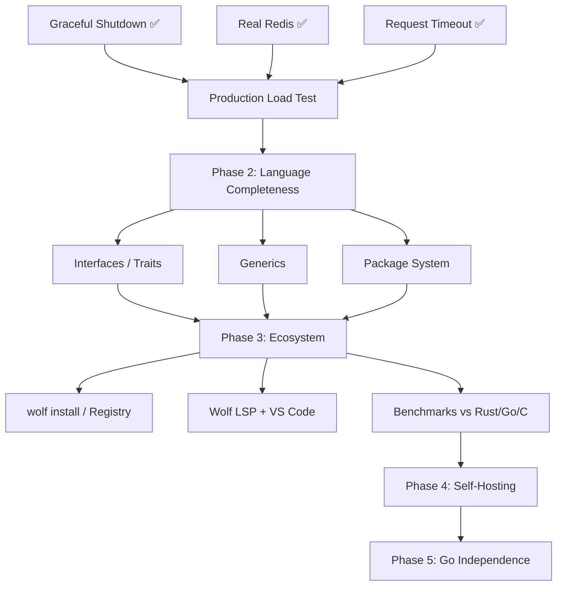

# Wolf — Execution Plan (Live Document)

> Updated every session via `/wrap-up`. Read via `/resume`.

## Current Sprint: Runtime Production Hardening

### Active Tasks (this session)
| Task | Status | Blocking |
|------|--------|---------|
| Memory arena allocator | ✅ Done (was already in runtime) | — |
| Real Redis / hiredis | ✅ Done (session 2) | — |
| wolf.config system | ✅ Done | — |
| MySQL connection pool | ✅ Done | — |
| wolf_db_pool_destroy() | ✅ Done (this session) | — |
| Graceful shutdown (SIGTERM/SIGINT) | ✅ Done (this session) | — |
| Request timeout (SO_RCVTIMEO, 408) | ✅ Done (this session) | — |
| MSSQL real implementation | 🔄 Next | freetds-dev or unixodbc-dev |
| File upload handling | ⬜ Queued | — |
| WebSocket support | ⬜ Queued | — |
| Production load test | ⬜ Queued | MSSQL or skip to test |

### Dependency Graph (Mermaid)

### Next Unblocked Tasks
1. **Real MSSQL** — install `freetds-dev`, replace `#ifdef WOLF_DB_MSSQL` mock
2. **Production load test** — benchmark against p50/p95/p99 targets
3. **File upload handling** — multipart/form-data in http_worker
4. **WebSocket support** — wolf_ws_* in wolf_runtime.c
5. **Stdlib expansion** — HTTP client (STDLIB-06)

## Session History

### 2026-03-20 (Session 3)
**Done:**
- Confirmed arena allocator was already shipped (plan was stale)
- Confirmed hiredis was already shipped (plan was stale)
- Implemented `wolf_db_pool_destroy()` — closes all pool slots, broadcasts
  cond to unblock waiting threads, frees credential strings
- Implemented graceful shutdown:
  - `SIGTERM` / `SIGINT` handler sets `wolf_shutdown_requested`
  - `accept()` loop exits on signal (no SA_RESTART)
  - New connections get 503 during drain window
  - Drain loop busy-waits up to `WOLF_REQUEST_TIMEOUT_SEC + 2s`
  - Calls `wolf_db_pool_destroy()` → `mysql_library_end()` → `exit(0)`
- Implemented request timeout:
  - `SO_RCVTIMEO` set to `WOLF_REQUEST_TIMEOUT_SEC` (default 30s) per worker
  - Timeout returns HTTP 408, logs the fd
  - Override with `-DWOLF_REQUEST_TIMEOUT_SEC=N`
- Added `SIGPIPE` ignore (prevents process death on broken client socket)
- Atomic in-flight counter (`wolf_active_requests`) using `__atomic_fetch_add/sub`
- Added `wolf_db_pool_destroy()` declaration to `wolf_runtime.h`
- Implemented real JWT encode/decode (`wolf_jwt_encode`, `wolf_jwt_decode`), replacing the fake HMAC stub
- Implemented STDLIB-02 (Array functions: `array_chunk`, `array_column`, `array_sum`, etc.)
- Written `LICENSE` (MIT, Divine Osarumwense Victor / Loneewolf15, 2026)

**Files modified:**
- `runtime/wolf_runtime.c`
- `runtime/wolf_runtime.h`
- `LICENSE` (new)

**Next:** Real MSSQL → load test → file uploads

### 2026-03-19 (Session 2)
**Commits:** `...` chore: push recent fixes · `...` feat: Multi-DB + Real Redis
**Done:**
- Removed AgSkill and BackendTemplate from repo
- Multi-DB driver support (Postgres, MSSQL mock)
- Real Redis via hiredis with thread-local contexts
- Compiler auto-selects -D flags and linker flags from wolf.config driver=

### 2026-03-18 (Sessions 1–2)
**Commits:** `73818ba` · `208de88`
**Done:**
- Fixed 3 critical bugs: sendResponse data, json_decode unicode, method interpolation
- Built wolf.config system (INI parser, Go struct, C header, -D baking)
- MySQL connection pool (C, mutex+cond_var, WOLF_DB_POOL_SIZE)
- Fixed main.go broken NewWithConfig calls

### 2026-03-05 to 2026-03-15 (Earlier sessions)
**Done:**
- Full LLVM IR emitter (replacing Go transpilation)
- 21 e2e tests written and passing
- HTTP server with MySQL/Redis/JWT stdlib
- All 16 early bugs fixed

## Parallel Agent Instructions

When spawning multiple agents, assign tasks from the graph above by unblocked status.
Always reference vault files:
- Architecture: `.wolf-vault/RnD/architecture.md`
- Bugs: `.wolf-vault/RnD/bugs_fixed.md`
- This plan: `.wolf-vault/Execution/plan.md`
- Last handoff: `.wolf-vault/Sessions/latest_handoff.md`