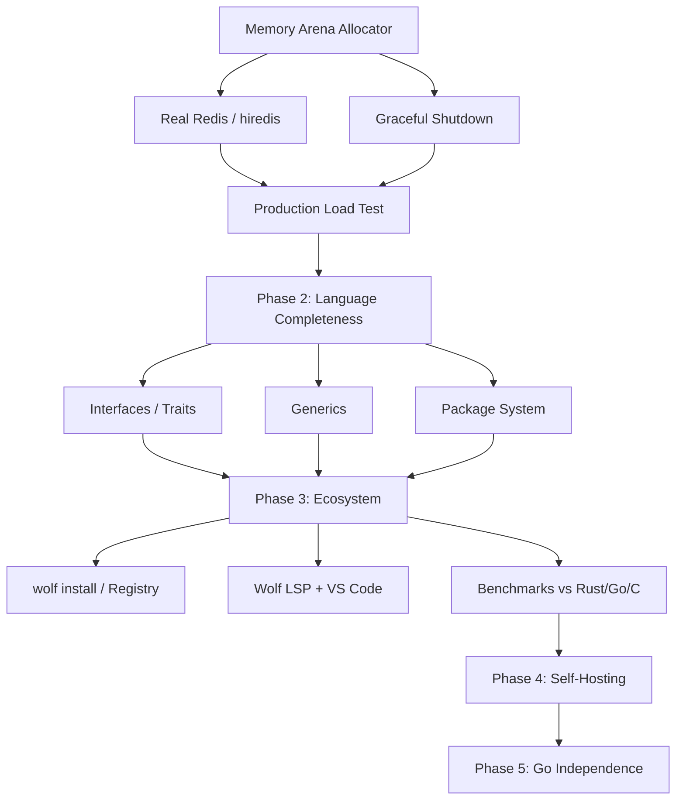

# Wolf — Execution Plan (Live Document)

> Updated every session via `/wrap-up`. Read via `/resume`.

## Current Sprint: Runtime Production Hardening

### Active Tasks (this session)
| Task | Status | Blocking |
|------|--------|---------|
| Memory arena allocator (BUG-017) | 🔄 In progress | Real Redis |
| wolf.config system | ✅ Done | — |
| MySQL connection pool | ✅ Done | — |
| sendResponse data={} fix | ✅ Done | — |
| json_decode \uXXXX unicode | ✅ Done | — |
| {$this->method()} interpolation | ✅ Done | — |

### Dependency Graph (Mermaid)

### Next Unblocked Tasks (can spawn parallel agents)
1. **Memory arena** (BUG-017) — `runtime/wolf_runtime.c`
2. **hiredis integration** — `runtime/wolf_runtime.c` (after arena done)
3. **HTTP client stdlib** — new `runtime/wolf_http_client.c`
4. **Benchmarking suite** — write Wolf vs Rust/Go/C comparison scripts

## Session History

### 2026-03-18 (Sessions 1–2)
**Commits:** `73818ba` · `208de88`
**Done:**
- Fixed 3 critical bugs: sendResponse data, json_decode unicode, method interpolation
- Built wolf.config system (INI parser, Go struct, C header, compiler -D baking)
- Implemented MySQL connection pool (C, mutex+cond_var, WOLF_DB_POOL_SIZE)
- Fixed main.go broken NewWithConfig calls
**Next:** Memory arena allocator → real Redis → graceful shutdown

### 2026-03-05 to 2026-03-15 (Earlier sessions)
**Done:**
- Full LLVM IR emitter (replacing Go transpilation)
- 21 e2e tests written and passing
- HTTP server with MySQL/Redis/JWT stdlib
- All 16 early bugs fixed (for_loop, foreach, json encoding, interpolation, DB segfault...)

## Parallel Agent Instructions

When spawning multiple agents, assign tasks from the graph above by unblocked status.
Always reference vault files:
- Architecture: `.wolf-vault/RnD/architecture.md`
- Bugs: `.wolf-vault/RnD/bugs_fixed.md`
- This plan: `.wolf-vault/Execution/plan.md`
- Last handoff: `.wolf-vault/Sessions/latest_handoff.md`
