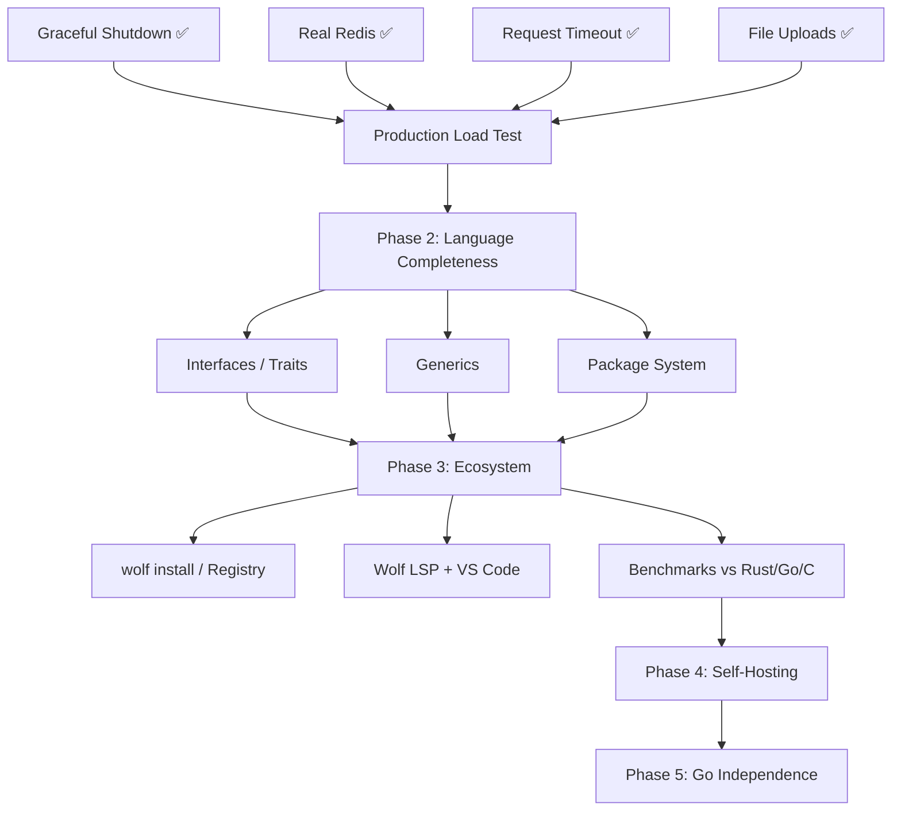

# Wolf — Execution Plan (Live Document)

> Updated every session via `/wrap-up`. Read via `/resume`.

## Current Sprint: Sprint 7 — Database Parity & Benchmarking 🔄

### Active Tasks
| Task | Status | Blocking |
|------|--------|---------|
| Real MSSQL implementation | 🔄 Active | freetds-dev |
| Production Load Test (Wolf vs Go) | 🔄 Active | — |
| Date Object Stdlib (STDLIB-04) | ⬜ Queued | — |
| ORM-ready Query Builder (DB-01) | ⬜ Queued | — |

## Completed Sprints
- [x] **Sprint 6: Native Foundations** (WebSocket, HTTP Client, Math/Stats) — 2026-03-26
- [x] **Sprint 5: File Uploads & Metal-Ready** — 2026-03-25
- [x] **Sprint 4: Technical Debt** — 2026-03-25
- [x] **Sprint 1-3: Hardware & Performance Baseline** — 2026-03-20

### Dependency Graph (Mermaid)

### Next Unblocked Tasks
1. **Real MSSQL** — install `freetds-dev`, replace `#ifdef WOLF_DB_MSSQL` mock
2. **WebSocket support** — `wolf_ws_*` in `wolf_runtime.c`
3. **Production load test** — benchmark against p50/p95/p99 targets
4. **Stdlib HTTP client** — outbound HTTP requests from Wolf scripts (STDLIB-06)
5. **wolf_http_serve multi-port** — multiple handlers on different ports

## Session History

### 2026-03-25 (Session 5 — File Uploads & Metal-Ready Audit)
**Done:**
- Implemented native `multipart/form-data` parsing (`wolf_parse_multipart`)
- Added `wolf_upload_t` struct to `wolf_http_context_t` (arena-allocated, up to 8 files/req)
- Added `wolf_http_req_file(req_id, field_name)` → JSON `{name,type,size,data}` public API
- Added `wolf_http_req_file_count(req_id)` helper
- Added `wolf_file_save(path, b64_data)` — binary-safe file persist from upload
- Added `wolf_base64_encode_bin(data, size)` — binary-safe base64 (replaces strlen-based version)
- Fixed LLVM emitter: `wolf_http_req_file` arg0 now correctly emitted as `i64` not `ptr`
- Metal-Ready audit: wrapped OS-only includes + entire HTTP server + Req/Res API in `#ifndef WOLF_FREESTANDING`
- Both normal and freestanding compiles: zero errors
- All 24 E2E tests pass (22 standard + TestGracefulShutdown + TestFileUpload)

### 2026-03-25 (Session 4 — Technical Debt Resolution)
**Done:**
- Audited technical debt; addressed 4 high/medium priority targets:
  - `wolf_sprintf` updated to use variadic `vsnprintf`
  - JSON decoder updated for surrogate pairs (emojis)
  - Shutdown drain converted from busy-wait to `pthread_cond_t`
  - MSSQL mock warnings silenced

### 2026-03-20 (Session 3 — Production Hardening)
**Done:** Graceful shutdown, request timeout (SO_RCVTIMEO), SIGPIPE guard, pool destroy, CLI args

### 2026-03-19 (Session 2 — Real Redis + Multi-DB)
**Done:** hiredis integration, Postgres, MSSQL mock, DB driver auto-selection

### 2026-03-18 (Session 1 — Production Baseline)
**Done:** LLVM IR backend, wolf.config, MySQL pool, JSON, arrays, maps, E2E suite (22 tests)