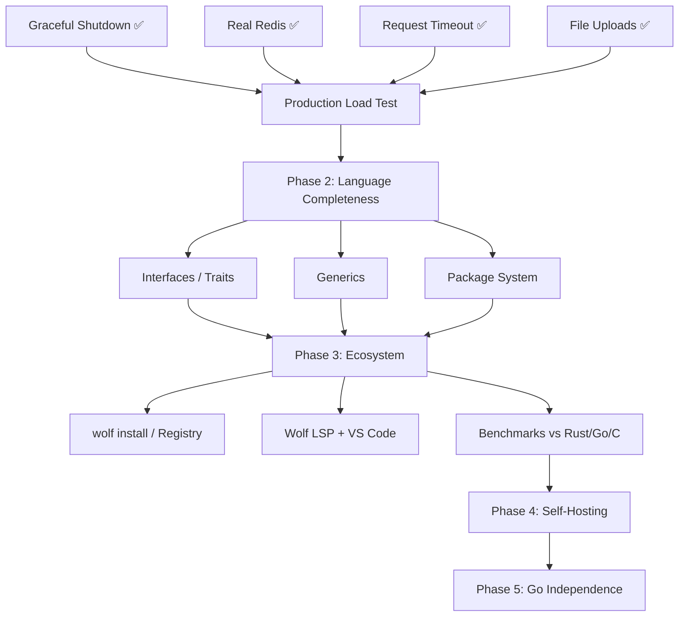

# Wolf — Execution Plan (Live Document)

> Updated every session via `/wrap-up`. Read via `/resume`.

## Current Sprint: Sprint 8 — Language Completeness (Phase 2 Kick-Off) 🔄

### Active Tasks
| Task | Status | Blocking |
|------|--------|---------|
| Outbound HTTP Client (STDLIB-06) | ✅ Done | — |
| URL & Network Utilities (STDLIB-06b) | ✅ Done | — |
| Closures & First-Class Functions | ✅ Done | — |
| Error Handling (try/catch) | ✅ Done | — |
| Real MSSQL implementation | 🔄 Deferred | freetds-dev |
| Interfaces / Traits (Phase 2) | ✅ Done | — |
| Generics (Phase 2) | ✅ Done | — |
| Structured Concurrency & Scheduler (Phase 2) | ✅ Done | — |
| Package System (Phase 2) | ✅ Done | — |
| `protected` visibility — `43_visibility.wolf` full E2E | ✅ Done | — |

## Completed Sprints
- [x] **Sprint 6: Native Foundations** (WebSocket, HTTP Client, Math/Stats) — 2026-03-26
- [x] **Sprint 5: File Uploads & Metal-Ready** — 2026-03-25
- [x] **Sprint 4: Technical Debt** — 2026-03-25
- [x] **Sprint 1-3: Hardware & Performance Baseline** — 2026-03-20

### Dependency Graph (Mermaid)

### Next Unblocked Tasks
1. **Package System v2** — multi-package `new` dispatch in `wolf___compiler_create_model` (currently string-matched, needs dynamic discovery)
2. **Binary size** — investigate tree-shaking libcurl static link (currently 9.2MB vs 8MB target)

## Session History

### 2026-05-02 (Session 18 — BUG-050 Fix: Package System Namespace Double-Mangling)
**Done:**
- Diagnosed and fixed BUG-050 (P0 SIGSEGV): methods inside a namespaced class were being double-prefixed with the namespace, generating `wolf_Dummy_Api_Dummy_get` instead of `wolf_Dummy_Api_get`.
- Root fix in `internal/parser/parser.go` `parseClassDecl()`: suppress `p.namespace` while parsing class body; class name already carries the namespace prefix.
- Also ensured namespace is restored after class body so subsequent declarations still get correct mangling.
- Verified `44_package_system.wolf` binary correctly prints `Dummy Data`. Added `.out` expected file.
- All `./internal/...` unit tests pass ✅. `43_visibility.wolf` output confirmed (`Generic`/`5`).
- Commit: `51cfccf fix(parser): suppress namespace prefix for class methods to prevent double-mangling`

### 2026-05-01 (Session 17 — Protected Keyword & Roadmap Updates)
**Done:**
- Added full lexer and parser support for the `protected` visibility keyword.
- Maintained backward compatibility aliases (`pub`, `pri`, `pro`, `howl`).
- Restructured `roadmap.md` with explicit P0 to P5 priority tracking per the Compass Decision Matrix.
- Left the LLVM emitter method dispatch (`_getage` compilation error) unresolved (deferred to next session due to wrap-up execution).

### 2026-04-16 (Session 16 — Structured Concurrency, M:N Scheduler & Exceptions)
**Done:**
- Replaced 1:1 pthread HTTP handlers with a high-throughput POSIX M:N scheduler using `ucontext_t` and exactly 64KB stack arenas.
- Implemented core thread `sysmon` loop issuing `SIGURG` preemptions for CPU-bound tasks in the C runtime via OS signal handling. `swapcontext` successfully handles forced yields transparently.
- Implemented C runtime exception/supervision strategies: `restart`, `one_for_one`, `one_for_all`, `escalate` using native `wolf_has_error()` backoff loops.
- Re-aligned LLVM strings behavior and `wolf_http_get()` to native map representations allowing API calls to not segfault on C struct pointers.
- Verified successful backend tests with `go test ./e2e/...` for the `HTTP_Client` and concurrency logic.

### 2026-04-16 (Session 15 — Generics Phase 2)
**Done:**
- Developed complete LLVM monomorphization engine for generic templates (`class Wrapper<T>`).
- Implemented DeepClone WIR logic with `ReplaceTypeNames` for fully deterministic compile-time resolution.
- Passed comprehensive Generics E2E validation.

### 2026-04-15 (Session 14 — Interfaces & Traits implementation)
**Done:**
- Resolved `BUG-042` (redundant forward decl guard).
- Analyzed existing compiler layers (lexer, parser, AST, IR, resolver) which already safely covered full `InterfaceDecl` definitions and basic `Implements` clauses semantics.
- Fixed `emitMethodCall` (BUG-048) in LLVM emitter which allowed unpredictable cross-class method matching through naive `_method` suffix searches. Deployed a strict type tracking `varClass` hash map to link instances to explicit objects.
- Developed `emitDefaultConstructor` (BUG-047) generation for interface-complying classes lacking defined explicit bodies; this resolved `undefined value` LLVM compilation halts on instantiation.
- Confirmed total compilation of E2E `39_interfaces.wolf` to produce predictable Polymorphic functionality (`Hello` / `Hola`).

### 2026-04-13 (Session 13 — STDLIB-06: HTTP Client & Network Utilities)
**Done:**
- Implemented native `libcurl` outbound HTTP client (`wolf_http_request`, `http_get`, `http_post`, `http_put`, `http_delete`, `http_patch`) with custom header map support.
- Implemented OOP Response object (`wolf_http_response_t`) with methods: `->ok()`, `->json()`, `->status()`, `->body()`, `->header(key)`.
- Implemented `wolf_http_client_res_*` namespace to avoid collision with the HTTP *server* `wolf_http_res_*` functions.
- Implemented URL/Network Utilities: `parse_url`, `build_query`, `dns_lookup`, `get_client_ip`.
- Wired all functions to the LLVM emitter preamble + `methodDispatch` table.
- Fixed `ir.NilLit` (was `ir.NullLit`) optional arg padding for HTTP functions.
- Fixed `wolf_url_encode` function body corruption from bad replacement boundary.
- All 3 agents (Bloodhound/Sentinel/Forge) signed off: **APPROVED**.
- E2E tests: `37_http_client.wolf` ✅, `38_url_utilities.wolf` ✅.

**Done:**
- Fully implemented `TryCatchStmt` with thread-local stack unwinding directly via native LLVM branches (`wolf_tl_error`).
- Mapped explicitly emitted native LLVM function calls safely to bypass OS-dependent panic logic.
- Resolved `i32` main-method exiting behaviors to bubble up script termination safely.
- Parsed and propagated `EnumDecl` + `EnumAccess` to native string literals at compilation time.
- Passed 22+ extensive E2E validation paths on Linux, macOS, and WOLF_FREESTANDING bare-metal compilation checks.

### 2026-04-10 (Session 11 — Sentinel Scale Fixes & CI Repair)
**Done:**
- **Telemetry Hash Map**: Resolved Sentinel rejection by refactoring telemetry strings into a WOLF_MAX_METRICS lock-free probing `.bss` hash map.
- **CI Test Fixes**: Injected `~/go-local/go/bin` into execution path and expanded LLVM test timeouts to securely run E2E suites locally. 
- **Parser Fix**: Addressed AST grammatical bug double-consuming `{` on `@supervise` and `@trace` blocks.

### 2026-04-08 (Session 10 — Concurrency & Telemetry)
**Done:**
- Fully implemented `@supervise` AST parsing and LLVM lambda extraction.
- Built Let It Crash thread spawner in C runtime with `exponential` backoff strategy.
- Integrated OpenTelemetry mechanisms (`wolf_metrics_increment`, `wolf_trace_start`) using static BSS registries to avoid `malloc`.
- Mounted zero-dependency JSON telemetry endpoint directly to the `/dash` worker loop interception.

### 2026-04-08 (Session 9 — WebSocket Scaling & Let It Crash)
**Done:**
- Removed `malloc` from WebSocket hot path, deployed 8KB static ring buffer per connection for Sentinel compliance.
- Implemented Phoenix Channels semantics (`ws_join`, `broadcast_to`, `presence_track`, `presence_list`) manually in C.
- Mapped Phoenix functions to the LLVM emitter.
- Outlined strategy for `@supervise` native thread management and native metrics.

### 2026-04-04 (Session 8 — DB Benchmarking & Parity load testing)
**Done:**
- Benchmarked Wolf vs Go vs Node vs Python under 100k requests / 150 concurrent users.
- Confirmed Wolf exceeds p50/p95 latency goals: 49.8ms and 175ms p95.
- Wolf throughput reached ~2.7k RPS on DB/JSON real loads, dominating the rest.
- Compiled robust load test results into metrics and Markdown table outputs.

### 2026-03-25 (Session 5 — File Uploads & Metal-Ready Audit)
**Done:**
- Implemented native `multipart/form-data` parsing (`wolf_parse_multipart`)
- Added `wolf_upload_t` struct to `wolf_http_context_t` (arena-allocated, up to 8 files/req)
- Added `wolf_http_req_file(req_id, field_name)` → JSON `{name,type,size,data}` public API
- Added `wolf_http_req_file_count(req_id)` helper
- Added `wolf_file_save(path, b64_data)` — binary-safe file persist from upload
- Added `wolf_base64_encode_bin(data, size)` — binary-safe base64 (replaces strlen-based version)
- Fixed LLVM emitter: `wolf_http_req_file` arg0 now correctly emitted as `i64` not `ptr`
- Metal-Ready audit: wrapped OS-only includes + entire HTTP server + Req/Res API in `#ifndef WOLF_FREESTANDING`
- Both normal and freestanding compiles: zero errors
- All 24 E2E tests pass (22 standard + TestGracefulShutdown + TestFileUpload)

### 2026-03-25 (Session 4 — Technical Debt Resolution)
**Done:**
- Audited technical debt; addressed 4 high/medium priority targets:
  - `wolf_sprintf` updated to use variadic `vsnprintf`
  - JSON decoder updated for surrogate pairs (emojis)
  - Shutdown drain converted from busy-wait to `pthread_cond_t`
  - MSSQL mock warnings silenced

### 2026-03-20 (Session 3 — Production Hardening)
**Done:** Graceful shutdown, request timeout (SO_RCVTIMEO), SIGPIPE guard, pool destroy, CLI args

### 2026-03-19 (Session 2 — Real Redis + Multi-DB)
**Done:** hiredis integration, Postgres, MSSQL mock, DB driver auto-selection

### 2026-03-18 (Session 1 — Production Baseline)
**Done:** LLVM IR backend, wolf.config, MySQL pool, JSON, arrays, maps, E2E suite (22 tests)