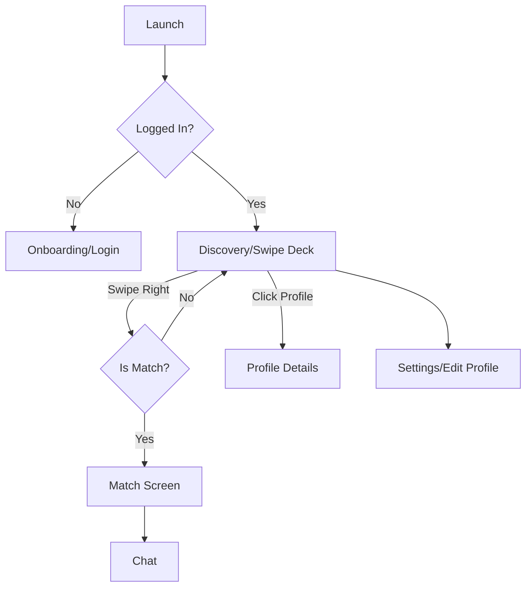

# Product Requirements Document (PRD): PawMatch

## 1. Executive Summary
**Date:** 2026-01-25
**Status:** Draft
**Author:** AI Assistant

PawMatch is a location-based mobile application designed to connect dog owners for playdates, walking companionship, and socialization. Modeled after the "swipe" mechanic popularized by Tinder, it simplifies the process of finding compatible canine friends based on size, energy level, and temperament. The goal is to reduce dog loneliness and improve socialization for urban pets.

## 2. Product Overview & Goals

### 2.1 Problem Statement
Urban dog owners often struggle to find safe, compatible playmates for their pets. Dog parks can be chaotic and unpredictable, while arranging meetups via forums is inefficient.

### 2.2 Strategic Value
PawMatch creates a dedicated vertical social network. By capturing the pet owner demographic (high engagement, high spend), we create opportunities for future monetization via premium features (PawMatch Gold) and local business partnerships (ads for groomers, vets).

### 2.3 Objectives
*   Launch MVP on iOS and Android within 3 months.
*   Achieve 10,000 active users in the launch city within 6 months.
*   Facilitate 5,000 successful "matches" (mutual likes) in the first month.

## 3. Target Audience & Personas

### 3.1 Primary Personas
*   **"Busy Professional" Ben**: 28, single, owns a high-energy Husky. Needs to find other high-energy dogs to tire his dog out before work. Values efficiency.
*   **"New Mom" Sarah**: 34, married, owns a shy rescue dog. Wants to find gentle, calm dogs for controlled socialization. Values safety and verification.

### 3.2 Secondary Personas
*   **"Dog Walker" Dave**: Professional walker looking to group compatible clients together.

## 4. Success Metrics (KPIs)
*   **Adoption:** 1,000 downloads in week 1.
*   **Engagement:** Average time spent > 5 minutes/day; 10 swipes/day avg.
*   **Retention:** 40% Day-30 retention.
*   **Match Rate:** % of swipes that result in a match (target > 5%).

## 5. User Stories & Use Cases

### 5.1 User Stories
| ID | As a... | I want to... | So that... |
| :--- | :--- | :--- | :--- |
| US-001 | Dog Owner | Create a profile for my dog with photos and traits | Others can see if our dogs are compatible. |
| US-002 | Dog Owner | Filter potential matches by size and energy level | I don't match my Chihuahua with a Great Dane. |
| US-003 | Dog Owner | Swipe right to like or left to pass | I can quickly sort through local options. |
| US-004 | Dog Owner | Chat with a match | We can arrange a meetup time and location. |
| US-005 | Dog Owner | Report aggressive dogs | The community stays safe. |

### 5.2 Detailed Use Cases
**UC-01: Matching Flow**
*   **Actor:** Dog Owner
*   **Preconditions:** User is logged in, location services enabled.
*   **Main Flow:**
    1.  System displays a card with Dog Photo, Name, Breed, Distance.
    2.  User swipes Right.
    3.  System checks if target dog has already liked User.
    4.  If yes, "It's a Match!" screen appears with "Chat Now" button.
*   **Postconditions:** Match created in database.

## 6. Functional Requirements

### 6.1 Authentication & Profile
*   **FR-01:** System shall allow sign-up via Google, Apple ID, or Phone Number.
*   **FR-02:** User must upload at least 1 photo of the dog to activate profile.
*   **FR-03:** Profile must include mandatory fields: Breed, Age, Gender, Size, Energy Level (Low/Med/High).

### 6.2 Discovery Engine
*   **FR-04:** Matching algorithm shall prioritize distance (< 10km by default).
*   **FR-05:** Users shall be able to set specialized filters (e.g., "Hypoallergenic only").

### 6.3 Messaging
*   **FR-06:** Chat functionality shall only be enabled between mutually matched users.
*   **FR-07:** System shall support text and image sharing in chat.

## 7. Non-Functional Requirements (NFRs)
*   **Performance:** Profile cards load in < 500ms.
*   **Scalability:** Support 50k concurrent active swipers.
*   **Security:** Location data must be obfuscated (show "approximate location", not exact coordinates).
*   **Privacy:** Compliance with GDPR/CCPA for owner data.

## 8. Database Schema & Data Models

### 8.1 Key Entities
*   **User (Owner):** `id`, `email`, `auth_token`, `location_lat`, `location_long`
*   **Dog:** `id`, `owner_id`, `name`, `breed`, `birthdate`, `size`, `energy_level`, `bio`, `photos_array`
*   **Swipe:** `id`, `swiper_dog_id`, `swiped_dog_id`, `action` (LIKE/PASS), `timestamp`
*   **Match:** `id`, `dog_a_id`, `dog_b_id`, `created_at`
*   **Message:** `id`, `match_id`, `sender_id`, `text`, `timestamp`

### 8.2 ER Diagram Schema
```mermaid
graph LR
    User ||--|{ Dog : owns
    Dog ||--|{ Swipe : initiates
    Dog ||--|{ Match : participates
    Match ||--|{ Message : contains
```

## 9. Design & UI/UX

### 9.1 User Flow


### 9.2 Wireframes / Sketches

**Screen 1: Discovery (The Swipe Deck)**
```text
+--------------------------------------------------+
|  [User Icon]      PawMatch        [Chat Icon]    |
+--------------------------------------------------+
|                                                  |
|   +------------------------------------------+   |
|   |                                          |   |
|   |              DOG PHOTO                   |   |
|   |                                          |   |
|   |                                          |   |
|   |  Rex, 3 yrs                              |   |
|   |  Golden Retriever • 2km away             |   |
|   +------------------------------------------+   |
|                                                  |
|      (X) PASS               (♥) PLAY             |
|                                                  |
+--------------------------------------------------+
|  [Deck]    [My Profile]     [Settings]           |
+--------------------------------------------------+
```

**Screen 2: Chat List**
```text
+--------------------------------------------------+
|  Matches                         [Search]        |
+--------------------------------------------------+
| New Matches (Row)                                |
| (O)  (O)  (O)  (O)                               |
| Rex  Luna Max  Bella                             |
+--------------------------------------------------+
| Messages                                         |
| [Img] Luna: "Is Rex friendly with..."   10m ago  |
| [Img] Max: "Park at 5pm?"               1h ago   |
| [Img] Buddy: (Sent a photo)             Yesterday|
+--------------------------------------------------+
```

## 10. Constraints, Assumptions & Dependencies

### 10.1 Constraints
*   **Geolocation**: Dependency on accurate GPS hardware.
*   **Mobile-Only**: MVP is mobile app only, no web interface for swiping.

### 10.2 Assumptions
*   Owners are willing to travel up to 5-10km for a playdate.
*   Owners will honestly report their dog's behavior.

### 10.3 Dependencies
*   Third-party Maps API (Google/Mapbox).
*   Push Notification Service (OneSignal/Firebase).

## 11. Release Criteria & Timeline

### 11.1 Phasing
*   **Alpha (Month 1):** Internal testing, swipe mechanics, fake data.
*   **Beta (Month 2):** 100 User closed beta in one neighborhood.
*   **Launch (Month 3):** Full City Launch.

### 11.2 Launch Checklist
*   [ ] App Store / Play Store Approval
*   [ ] Privacy Policy Legal Review
*   [ ] Trust & Safety Guidelines Published (Reporting aggressive dogs)

## 12. Future Scope
*   **Monetization:** "Super Barks" (Super Likes), Boost Profile.
*   **Places:** Dog-friendly map integration.
*   **Groups:** "Pack Walks" feature.
