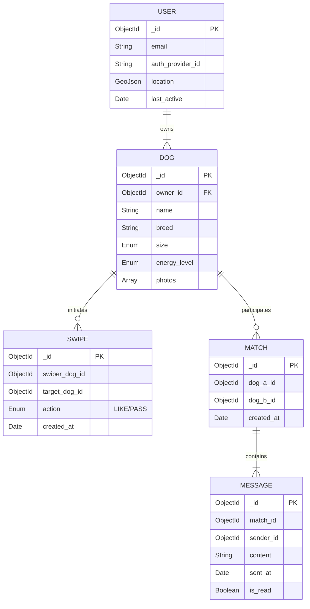

# Technical Requirements Document (TRD): PawMatch

## 1. System Overview
**Version:** 1.0
**Last Updated:** 2026-02-12

### 1.1 Scope
This document outlines the technical architecture for the PawMatch mobile application MVP. It covers the backend API, database schema, real-time messaging infrastructure, and mobile client requirements.
**Out of Scope:** Web interface for swiping, monetization features (Super Barks), and group/event features for the MVP.

### 1.2 Technology Stack
*   **Frontend:** React Native (Expo) - for cross-platform iOS/Android support.
*   **Backend:** Node.js with Express.
*   **Database:** MongoDB - for flexible schema storing user profiles and geospatial querying.
*   **Real-time:** Socket.io - for instant messaging.
*   **Infrastructure:** AWS (Elastic Beanstalk for API, Atlas for MongoDB, S3 for media storage).
*   **Third-party Services:** 
    *   Auth0 / Firebase Auth (Social Login)
    *   OneSignal (Push Notifications)
    *   Google Maps API (Geolocation)

## 2. System Architecture

### 2.1 High-Level Architecture
```mermaid
graph TD
    Client[Mobile App (React Native)] --> LB[Load Balancer]
    LB --> API[API Server (Node.js)]
    API --> Auth[Auth Service (Firebase)]
    API --> Socket[Socket.io Server]
    API --> Geo[Geospatial Service]
    API --> DB[(MongoDB)]
    API --> S3[AWS S3 (Images)]
    Socket <--> Client
```

### 2.2 Component Design
*   **Discovery Engine:** Responsible for fetching candidate profiles based on location ($near sphere query) and filters (size, energy). Excludes previously swiped profiles.
*   **Matching Service:** details asynchronous processing of swipes. When a swipe is "LIKE", it checks the `Swipe` collection for a reciprocal record. If found, triggers `Match` creation and notifies both users.
*   **Chat Service:** Handles real-time message delivery and persistence.

## 3. Data Design

### 3.1 Data Models / Schema



### 3.2 Data Flow - Swipe Match
1.  User A swipes RIGHT on User B.
2.  `POST /api/v1/swipes` called with `{ target_dog_id: B, action: 'LIKE' }`.
3.  Server saves Swipe record.
4.  Server queries `Swipe` collection: `find({ swiper_dog_id: B, target_dog_id: A, action: 'LIKE' })`.
5.  **If found:**
    *   Create `Match` document.
    *   Send Push Notification to both users via OneSignal.
    *   Return `{ match: true, match_id: ... }` to Client A.
6.  **If not found:**
    *   Return `{ match: false }`.

## 4. API Design

### 4.1 Endpoints
| Method | Endpoint | Description | Auth Required |
| :--- | :--- | :--- | :--- |
| POST | `/auth/login` | Exchange social token for session/JWT | No |
| POST | `/api/v1/dogs` | Create dog profile | Yes |
| GET | `/api/v1/discovery` | Get deck of dogs (params: lat, long, radius) | Yes |
| POST | `/api/v1/swipes` | Record a swipe action | Yes |
| GET | `/api/v1/matches` | Get list of matches | Yes |
| GET | `/api/v1/matches/:id/messages` | Get chat history | Yes |

### 4.2 API Contracts (Swipe)
**Request:** `POST /api/v1/swipes`
```json
{
  "swiper_dog_id": "60d5ec...",
  "target_dog_id": "60d5ed...",
  "action": "LIKE"
}
```

**Response (Match):**
```json
{
  "status": "success",
  "match": true,
  "payload": {
    "match_id": "70a...",
    "partner_dog": { "name": "Rex", "photo": "url..." }
  }
}
```

## 5. Non-Functional Requirements (NFRs)

### 5.1 Performance
*   Discovery feed response < 200ms.
*   Image optimization: All uploaded photos resized to max 1080px width and webp format.
*   Socket connection latency < 100ms.

### 5.2 Security
*   **JWT Authentication:** Stateless auth for API.
*   **Location Privacy:** API never returns exact coordinates of other users, only calculated distance.
*   **Rate Limiting:** Max 100 swipes per minute to prevent botting.

### 5.3 Scalability
*   **Database:** Horizontal sharding on `location` for Discovery queries if users > 100k.
*   **Caching:** Redis to cache user profiles and active session data.

### 5.4 Reliability
*   Automatic retries for failed message delivery.
*   Daily backups of MongoDB Atlas cluster.

## 6. Implementation Plan / DevOps

### 6.1 Development Phases
*   **Phase 1 (Wk 1-2):** Auth, Profile CRUD, S3 Integration.
*   **Phase 2 (Wk 3-4):** Geolocation Discovery & Swipe Logic.
*   **Phase 3 (Wk 5-6):** Real-time Chat & Notifications.

### 6.2 CI/CD Pipeline
*   GitHub Actions for CI.
*   Linting (ESLint) and Unit Tests (Jest) on PR.
*   Auto-deploy to AWS Elastic Beanstalk on merge to `main`.

## 7. Risks and Mitigation
| Risk | Impact | Mitigation |
| :--- | :--- | :--- |
| **Geolocation Inaccuracy** | High (Poor matches) | Use "fuzzy" matching radius; Allow manual city selection backup. |
| **Socket Connection Drop** | Medium (Missed messages) | Implement client-side queue and sync mechanism locally (SQLite/Realm). |
| **Bot/Spam Accounts** | Medium | Require phone number verification (OTP) at signup. |
