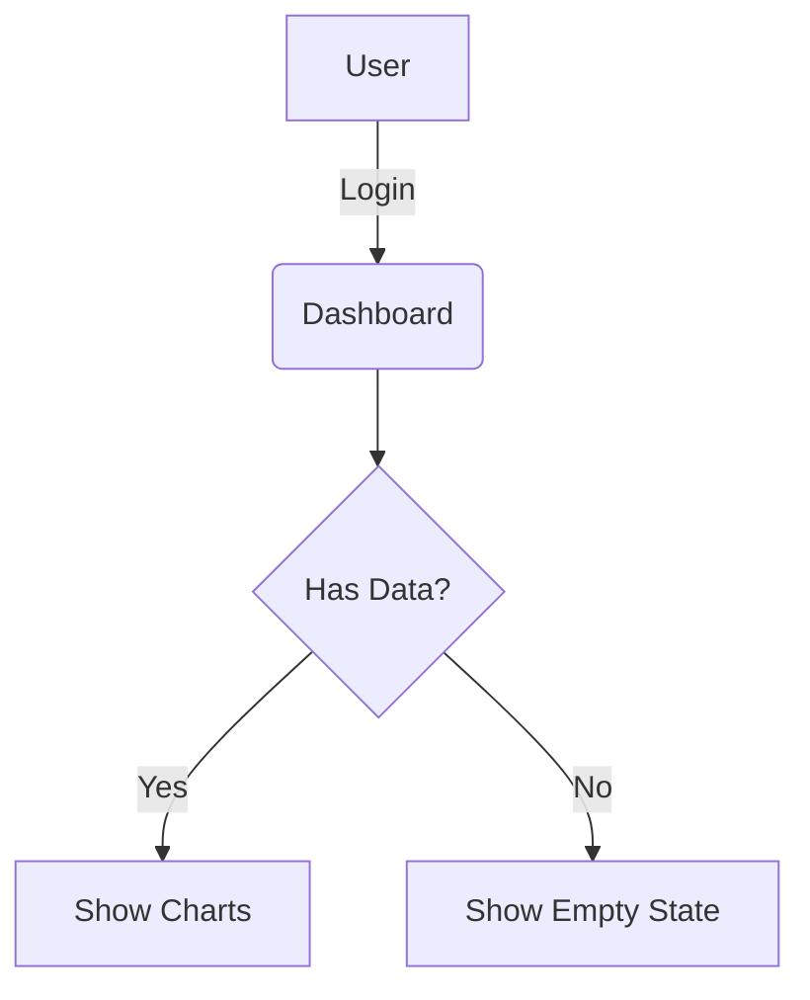

# PRD Creator

## Overview

This skill takes a user's initial input—whether it's a "napkin sketch" idea, a transcript, or an existing brief—and expands it into a professional, engineering-ready Product Requirements Document (PRD).

## Capabilities

1.  **Structure & Formality**: Organizes chaotic inputs into a standard [PRD Template](references/prd_template.md).
2.  **Gap Analysis**: Identifies missing critical information (e.g., "You mentioned a dashboard, but who is the user?") and either infers it (with explicit assumptions) or highlights it for the user.
3.  **Visuals**:
    *   Generates **Mermaid.js** diagrams for User Flows and ER Diagrams.
    *   Creates **ASCII Art** wireframes to visualize UI layouts initially.
4.  **Technical Depth**: Includes specific sections for Database Schemas (tables/fields), API definitions, and Non-Functionals (latency, security).

## Workflow

### 1. Analysis Phase
*   Read the user's input.
*   Identify the **Core Problem** and **User**.
*   Map out the key **Features**.
*   *Self-Correction*: If the input is too vague (e.g., "Build me an Uber clone"), ask 3-5 high-impact clarifying questions before generating the full doc. If the input is sufficient, proceed.

### 2. Drafting Phase
*   **Load the Template**: Use `references/prd_template.md` as the skeleton.
*   **Populate Sections**:
    *   **Executive Summary**: Synthesize the "Why".
    *   **Personas**: Create believable avatars (Name, Role, Motivation).
    *   **User Stories**: Follow "As a X, I want Y, so that Z".
    *   **Requirements**: strict `shall`/`must` language for Functional Requirements.
    *   **Database**: Propose a concrete schema (e.g., SQL tables or JSON documents).
    *   **Wireframes**: Use ASCII text blocks to show screen layout.

### 3. Review Phase
*   Check for **Constraints** and **Dependencies**. Did we list them?
*   Ensure **Success Metrics** are measurable (numbers, not just "users like it").

### 4. Output Phase
*   **Save Output**: ALWAYS save the final PRD to a specific directory in the user's workspace: `PRD/<Project_Name>_PRD.md`.
    *   Create the `PRD/` directory if it does not exist.
    *   Use a clear, sanitized filename (e.g., `PRD/TinderForDogs_PRD.md`).

## Visual Standards

### Wireframes (ASCII)
Use box-drawing characters or simple pipes/dashes to show layout.
```text
+-----------------------+
| Header      [Log Out] |
+-----------------------+
| [ Menu ]   [ Content ]|
|            [  Graph  ]|
|            [  List   ]|
+-----------------------+
```

### Diagrams (Mermaid)
Use standard Markdown `mermaid` blocks for flows.


## Reference

**Template**: [references/prd_template.md](references/prd_template.md) - The mandatory output structure.
