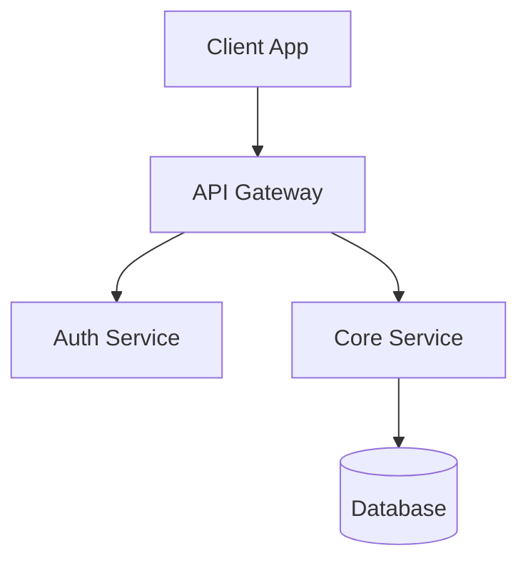
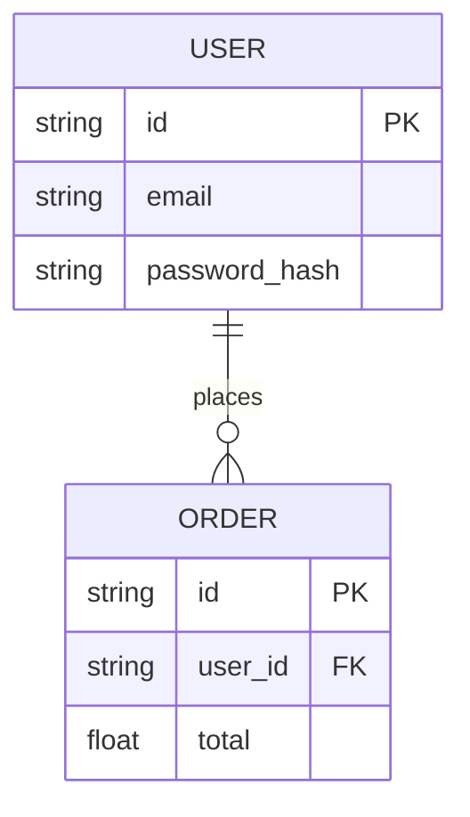

# Technical Requirements Document (TRD): [Project Name]

## 1. System Overview
**Version:** 1.0
**Last Updated:** [Date]

### 1.1 Scope
[Describe what is in scope and out of scope from a technical perspective.]

### 1.2 Technology Stack
*   **Frontend:** [e.g., React, TypeScript, Tailwind]
*   **Backend:** [e.g., Node.js, Express, Go]
*   **Database:** [e.g., PostgreSQL, Redis]
*   **Infrastructure:** [e.g., AWS, Docker, Kubernetes]
*   **Third-party Services:** [e.g., Stripe, SendGrid]

## 2. System Architecture

### 2.1 High-Level Architecture
[Mermaid diagram showing the high-level components and their interactions]



### 2.2 Component Design
*   **[Component A]:** [Responsibilities, Key Libraries/patterns]
*   **[Component B]:** [Responsibilities, Key Libraries/patterns]

## 3. Data Design

### 3.1 Data Models / Schema
[Define key entities and their attributes. Using a Mermaid ER diagram is recommended.]



### 3.2 Data Flow
[Describe how data moves through the system for key scenarios.]

## 4. API Design

### 4.1 Endpoints
| Method | Endpoint | Description | Auth Required |
| :--- | :--- | :--- | :--- |
| POST | `/api/v1/resource` | Creates a new resource | Yes |
| GET | `/api/v1/resource/:id` | Retrieves resource details | Yes |

### 4.2 API Contracts (Examples)
**Request:**
```json
{
  "field": "value"
}
```

**Response:**
```json
{
  "id": "123",
  "status": "success"
}
```

## 5. Non-Functional Requirements (NFRs)

### 5.1 Performance
*   API response time < [X]ms (95th percentile)
*   Support [X] requests per second

### 5.2 Security
*   Authentication mechanism (e.g., JWT, OAuth2)
*   Data encryption (at rest and in transit)
*   Rate limiting policies

### 5.3 Scalability
*   Horizontal scaling strategy
*   Database scaling (read replicas, sharding)

### 5.4 Reliability
*   Uptime SLA (e.g., 99.9%)
*   Backup and disaster recovery plan

## 6. Implementation Plan / DevOps

### 6.1 Development Phases
*   **Phase 1:** [Core infrastructure setup]
*   **Phase 2:** [MVP Features]

### 6.2 CI/CD Pipeline
*   Linting and Testing (Unit/Integration)
*   Build and Containerization
*   Deployment Strategy (Blue/Green, Canary)

## 7. Risks and Mitigation
| Risk | Impact | Mitigation |
| :--- | :--- | :--- |
| [Risk Description] | [High/Medium/Low] | [Mitigation Strategy] |
